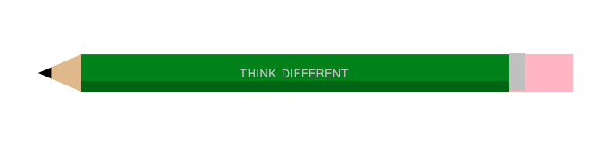
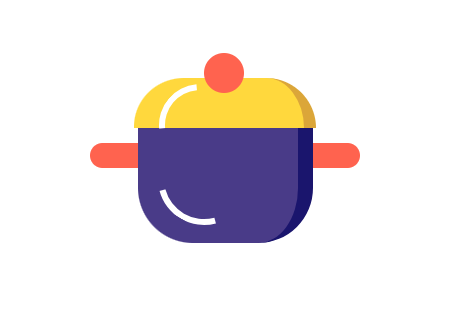

### CSS

#### 伪元素利用案例
**铅笔示例** 



``` html
<div class="pencil">
  <div class="taper"></div>
  <div class="barrel">Think Different</div>
  <div class="eraser"></div>
</div>
```
``` css
body{
  height: 100vh;
  display: flex;
  justify-content: center;
  align-items: center;
  background-color: rgb(194, 243, 232);
}
.pencil{
  display: flex;
  justify-content: center;
  width: 50em;
  height: 3.5em;
  font-size: 12px;
  filter: drop-shadow(0.4em, 0.8em, 0.3em, gray)
}
.taper{
  width: 4em;
}
.taper::before, .taper::after {
  content: '';
  position: absolute;
  border-style: solid;
  border-width: calc(3.5em/2) 4em calc(3.5em/2) 0;
  border-color: transparent;
}
.taper::before {
  border-right-color: burlywood;
}
.taper::after{
  border-right-color: black;
  transform-origin: left;
  transform: scale(0.3);
}
.barrel {
  width: 40em;
  background-color: green;
  border-top: 1px solid forestgreen;
  border-bottom: 1em solid darkgreen;
  color: silver;
  line-height: 3.5em;
  text-align: center;
  text-transform: uppercase;
  letter-spacing: 0.1em;
}
.eraser {
  position: relative;
  width: 6em;
  background-color: lightpink;
  /* border-top: 1px solid lightcoral; */
  border-radius: 0 0.5em 0.5m 0;
}
.eraser::before {
  content: '';
  position: absolute;
  width: 1.5em;
  height: 3.5em;
  background-color: silver;
  border-top: 1px solid lightgray;
  /* border-bottom: 1px solid gray; */
  top: -0.1em;
}
```

**砂锅示例** 



``` html
<figure class="steamer">
  <div class="lid"></div>
  <div class="pot"></div>
</figure>
```

``` css
body{
  height: 100vh;
  margin: 0;
  display: flex;
  align-items: center;
  justify-content: center;
  background-color: pink;
}
.steamer {
  font-size: 10px;
  width: 30em;
  height: 30em;
  background-color: white;
  border-radius: 50%;
  display: flex;
  flex-direction: column;
  align-items: center;
  justify-content: center;
  position: relative;
  z-index: 1;
}
.pot{
  width: 16em;
  height: 12em;
  background-color: darkslateblue;
  border-radius: 0.5em 0.5em 5.5em 5.5em;
  border-right: 1.5em solid midnightblue;
  position: relative;
}
.pot::before {
  content: '';
  position: absolute;
  width: 27em;
  height: 2.5em;
  background-color: tomato;
  border-radius: 1.25em;
  left: calc((16em + 1.5em - 27em) / 2);
  top: 2em;
  z-index: -1;
}
.lid {
  width: 17em;
  height: 5em;
  background-color: gold;
  border-radius: 6em 6em 0 0;
  border-right: 1.2em solid goldenrod;
  position: relative;
  top: 0.5em;
  z-index: 1;
}
.pot::after {
  content: '';
  position: absolute;
  width: 8em;
  height: 8em;
  border: 0.6em solid;
  border-color: transparent transparent white transparent;
  border-radius: 50%;
  top: 1em;
  left: 2em;
  transform: rotate(30deg);
}
.lid::before {
  content: '';
  position: absolute;
  width: 4em;
  height: 4em;
  background-color: tomato;
  border-radius: 50%;
  top: -2.5em;
  left: 7em;
}
.lid::after {
  content: '';
  position: absolute;
  width: 7em;
  height: 7em;
  border: 0.6em solid;
  border-color: transparent transparent transparent white;
  border-radius: 50%;
  top: 0.6em;
  left: 2.5em;
  transform: rotate(40deg);
}
```

**飞船示例** 


``` html
<div class="spacecraft">
  <span class="body"></span>
  <span class="engine"></span>
  <span class="fins"></span>
</div>
```

``` css
body {
  width: 100%;
  height: 100vh;
  display: flex;
  justify-content: center;
  align-items: center;
  background-color: lightblue;
}
.spacecraft {
  width: 11em;
  height: 15em;
  position: relative;
}
.body{
  position: absolute;
  width: 7em;
  height: 11em;
  background: linear-gradient(whitesmoke, darkgrey);
  border-radius: 50%/70% 70% 5% 5%;
  left: 2em;
  z-index: 1;
}
.body::before {
  content: '';
  position: absolute;
  box-sizing: border-box;
  width: 4em;
  height: 4em;
  background-color: deepskyblue;
  border-radius: 50%;
  border: 0.5em solid lightslategray;
  top: 3em;
  left: 1.5em;
  box-shadow: inset -0.2em 0.2em white;
}
.engine {
  position: absolute;
  width: 6em;
  height: 2em;
  background-color: #444;
  border-radius: 20%;
  top: 10em;
  left: 2.5em;
}
.engine::before {
  content: '';
  position: absolute;
  box-sizing: border-box;
  width: 4em;
  height: 4em;
  background: gold;
  border-radius: 80% 0 50% 45%/50% 0 80% 45%;
  transform: rotate(135deg);
  border: 0.5em solid orange;
  left: 1em;
  z-index: -1;
}
.fins::before, .fins::after {
  content: '';
  position: absolute;
  width: 2em;
  height: 6em;
  background: linear-gradient(tomato, darkred);
  top: 7em;
}
.fins::before {
  left: 0;
  border-radius: 3em 0 50% 100%;
}
.fins::after {
  right: 0;
  border-radius: 0 3em 100% 50%;
}
```
