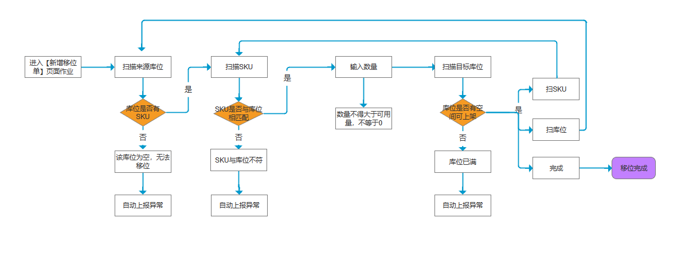

#### 开发者
  郑凯力
#### 开发时间
  2022-10-14

### 需求理解
仓库人员使用手持pda进行移位动作, 操作较为方便
  
  ### 移位
   设计稿链接:  <br> [https://pixso.cn/app/editor/Bt9nFlaohu549BxHoGZq7A?icon_type=1](https://pixso.cn/app/editor/Bt9nFlaohu549BxHoGZq7A?icon_type=1)
   
   <br>接口文档地址: [http://192.168.20.24:8881/api/pda/doc.html#/default_api/%E7%A7%BB%E4%BD%8D%E5%8D%95%E6%8E%A7%E5%88%B6%E5%B1%82/addShiftOrderDetailByPalletUsingPOST](http://192.168.20.24:8881/api/pda/doc.html#/default_api/%E7%A7%BB%E4%BD%8D%E5%8D%95%E6%8E%A7%E5%88%B6%E5%B1%82/addShiftOrderDetailByPalletUsingPOST) 
 
 
 
   
### 其中页面分为新增移位, 移位处理, 我的移位单, 异常移位单四个部分
    
### 新增移位
```js
import 'dart:async';
import 'dart:convert';

import 'package:flutter/cupertino.dart';
import 'package:flutter/material.dart';
import 'package:flutter/services.dart';
import 'package:flutter_vant_kit/main.dart';
import 'package:fluttertoast/fluttertoast.dart';
import 'package:get/get_core/src/get_main.dart';
import 'package:pda/http/inbound.dart';
import 'package:pda/http/shiftReturn.dart';
import 'package:pda/routers/add_shift_sheet.dart';
import 'package:pda/utils/local_storage.dart';
import 'package:pda/utils/local_utils.dart';
import 'package:pda/utils/my_colors.dart';
import 'package:division/division.dart';
import 'package:pda/widgets/commonStepDescribe.dart';
import 'package:pda/widgets/common_UI.dart';
import 'package:pda/widgets/common_btn.dart';
import 'package:pda/widgets/common_scanText.dart';
import 'package:pda/widgets/common_table.dart';
import 'package:get/get.dart';
import 'package:flutter_screenutil/flutter_screenutil.dart';


// import 'package:pda/utils/local_utils.dart';
import 'package:pda/widgets/common_text_field.dart';
import 'package:pda/widgets/common_toast.dart';

class AddShiftSheetController extends GetxController {
  String pageType = Get.arguments['type'];
  List addShiftSheetListSKU = [].obs;
  List addShiftSheetListTray = [].obs;
  late String title;

  getPageType() {
    pageType = Get.arguments['type'];
  }

  createTitle() {
    if (pageType == 'SKU') {
      return 'shiftSheetString6'.tr;
    } else {
      return 'shiftSheetString7'.tr;
    }
  }

  // 初始化操作
  initAddShiftSheetList() async {
    if (pageType == 'SKU') {
      String? localstring_addShiftSheetListSKU =
          await LocalStorage.getString('addShiftSheetListSKU');
      if (localstring_addShiftSheetListSKU != null) {
        List localList_addShiftSheetListSKU =
            json.decode(localstring_addShiftSheetListSKU);
        addShiftSheetListSKU = localList_addShiftSheetListSKU;
      }
    }
    if (pageType == 'Tray') {
      String? localstring_addShiftSheetListTray =
          await LocalStorage.getString('addShiftSheetListTray');
      if (localstring_addShiftSheetListTray != null) {
        List localList_addShiftSheetListTray =
            json.decode(localstring_addShiftSheetListTray);
        addShiftSheetListTray = localList_addShiftSheetListTray;
      }
    }
    if (pageType == 'SKU') {
      addShiftSheetListSKU = [];
    }
    if (pageType == 'Tray') {
      addShiftSheetListTray = [];
    }
  }

  // 退出页面操作, 保存缓存
  saveAddShiftSheetList() {
    if (pageType == 'SKU') {
      LocalStorage.setString(
          'addShiftSheetListSKU', json.encode(addShiftSheetListSKU));
    }
    if (pageType == 'Tray') {
      LocalStorage.setString(
          'addShiftSheetListTray', json.encode(addShiftSheetListTray));
    }
  }

  // 数据上传完成
  submitAddShiftSheetList() {
    if (pageType == 'SKU') {
      addShiftSheetListSKU = [];
    }
    if (pageType == 'Tray') {
      addShiftSheetListTray = [];
    }
    // saveAddShiftSheetList();
  }

  // 存入一条数据
  addOneToAddShiftSheetList(data) {
    if (pageType == 'SKU') {
      addShiftSheetListSKU.add(data);
      // 去重
      var checkInfo = ['sourceLocation', 'wydSku', 'targetLocation'];
      addShiftSheetListSKU =
          Utils.uniqeList(dataList: addShiftSheetListSKU, checkInfo: checkInfo);
    }
    if (pageType == 'Tray') {
      addShiftSheetListTray.add(data);
      var checkInfo = ['sourceLocation', 'tray', 'targetLocation'];
      addShiftSheetListTray = Utils.uniqeList(
          dataList: addShiftSheetListTray, checkInfo: checkInfo);
    }
  }
}

class AddShiftSheetPage extends StatelessWidget {
  const AddShiftSheetPage({Key? key}) : super(key: key);

  @override
  Widget build(BuildContext context) {
    final AddShiftSheetController c = Get.put(AddShiftSheetController());

    c.getPageType();
    // print(c.pageType);
    return Scaffold(
      appBar: AppBar(
        title: Text('${c.createTitle()}'),
        centerTitle: true,
        leading: IconButton(
          icon: Icon(Icons.arrow_back),
          onPressed: () async {
            // print('globalKey.currentState -- ${globalKey.currentState}');
            late List addList;
            if (c.pageType == 'SKU') {
              addList = c.addShiftSheetListSKU;
            }
            if (c.pageType == 'Tray') {
              addList = c.addShiftSheetListTray;
            }
            if (addList.length > 0) {
              print('这是当前存储的数据 ${addList}');
              showDialog(
                context: context,
                builder: (_) {
                  return MyNDialog(
                      title: null,
                      message: '${'shiftSheetString_message1'.tr}${addList.length}${'shiftSheetString_message2'.tr}',
                      showCancelButton: true,
                      confirmButtonText: 'shiftSheetString_dialog1'.tr,
                      onConfirm: () {
                        addShiftSheetGlobalKey.currentState?.submit(successfn: () {
                          Get.back();
                        }, catchFn: () {
                          Get.back();
                        }, falseFn: () {
                          // print('走了失败');
                          Get.back();
                        });
                      },
                      onCancel: () {});
                },
              );
            } else {
              Get.back();
            }
          },
        ),
        actions: <Widget>[
          IconButton(
              icon: Icon(Icons.list_alt),
              onPressed: () => {
                    Get.toNamed(AddShiftSheetRouter.addShiftSheetDetail),
                  }),
        ],
      ),
      body: UserTab1(tabNumber: 1, key: addShiftSheetGlobalKey),
    );
  }
}

GlobalKey<_UserTab1State> addShiftSheetGlobalKey = GlobalKey();

class UserTab1 extends StatefulWidget {
  const UserTab1({
    Key? key,
    this.tabNumber,
  }) : super(key: key);
  final tabNumber;

  _UserTab1State createState() => _UserTab1State();
}

class _UserTab1State extends State<UserTab1> {
  final AddShiftSheetController c = Get.find();
  FocusNode _focusNode = FocusNode();

  // 来源库位  获取sourceLocationController.text
  final sourceLocationController = TextEditingController();

  // 扫描sku
  final skuController = TextEditingController();

  // 目标库位A002
  final targetLocationController = TextEditingController();
  int step = 1;
  bool step1ButtonEnable = true;
  bool step2ButtonEnable = true;
  bool step3ButtonEnable = true;
  late Map tableData;
  late String pageTypeInfo = Get.arguments['type'];

  late String pageType;
  late String tableSKU;
  late String postSKU;
  String checkType = '1'; // 检验类型(1:来源库位校验 2:无忧达sku检验 3:移位数量检验 4:目标库位检验 5:来源托盘检验)
  // sku sourceLocation 'A001-stock'  sku:'zykkh1-zyj-71-A6'  zykkh1-zyj-71-A4  TO: 'A001-05-03'
  // 托盘 sourceLocation 'A002-629-A1'  tary: PCAJW32209260012  PCAJW32209260013  A001-05-0001
  String checkLocationVolumeType = '1'; // 检验库位体积是否充足  1 按sku检验  2 按托盘检验
  void initState() {
    
    
    var query = Get.arguments;
    pageType = Get.arguments['type'];
    print('${c.pageType} 测试');
    if (c.pageType == 'SKU') {
      tableSKU = 'SKU';
      postSKU = 'wydSku';
      tableData = {
        "From": "", // 参数sourceLocation 库位码
        // "Customer": "",
        tableSKU: "", // 参数 wydSku
        "QTY": "", // 参数shiftNum 数量
        "TO": "", // 参数 targetLocation 目标库位
      };
      checkLocationVolumeType = '1';
    } else {
      tableSKU = 'Pallet No';
      postSKU = 'tray';
      tableData = {
        "From": "", // 参数sourceLocation 库位码
        // "Customer": "",
        tableSKU: "", // 参数 tray  托盘号
        "QTY": "", // 参数shiftNum 数量
        "TO": "", // 参数 targetLocation 目标库位
      };
      checkLocationVolumeType = '2';
    }
    c.initAddShiftSheetList();
    print(c.addShiftSheetListSKU);

    // 在这里获取上面的传参 可以使用widget.tabNumber, widget表示UserTab1的值
    // print('${count} ----->${widget.tabNumber}');
  }

  @override
  Widget build(BuildContext context) {
    return Center(
      child: Column(
        children: [
          Expanded(
              child: SingleChildScrollView(
            child: Column(
              children: [_changeContent()],
            ),
          )),
          if (step == 1) ...[
            CommonBtn(
                text: 'next'.tr,
                height: 60.0,
                backgroundColor: MyColors.themeColor,
                textColor: MyColors.whiteColor,
                enable: step1ButtonEnable,
                onPressed: () {
                  Map postData = {
                    "sourceLocation": tableData['From'],
                    "checkType": '1',
                    "checkLocationVolumeType": checkLocationVolumeType
                  };
                  checkStep(postData: postData, clickType: 'next');
                }
                // onPressed: null,
                ),
          ] else if (step == 2) ...[
            CommonBtn(
                text: 'next'.tr,
                height: 60.0,
                backgroundColor: MyColors.themeColor,
                textColor: MyColors.whiteColor,
                enable: step2ButtonEnable,
                onPressed: () {
                  setState(() {
                    Map postData = {
                      "sourceLocation": tableData['From'],
                      postSKU: tableData[tableSKU],
                      "shiftNum": tableData['QTY'],
                      "checkType": pageType == 'SKU' ? '2' : '5',
                      "checkLocationVolumeType": checkLocationVolumeType
                      // sku检验2  托盘检验5
                    };
                    checkStep(postData: postData, clickType: 'next');
                  });
                }
                // onPressed: null,
                ),
          ] else if (step == 3) ...[
            Row(
              children: [
                Container(
                    width: MediaQuery.of(context).size.width / 3,
                    height: 60.0,
                    child: NButton(
                      text: pageType == 'SKU' ? 'shiftSheetString8'.tr : 'shiftSheetString9'.tr,
                      type: 'info',
                      disabled: step3ButtonEnable,
                      onClick: () {
                        Map postData = {
                          "sourceLocation": tableData['From'],
                          postSKU: tableData[tableSKU],
                          "shiftNum": tableData['QTY'],
                          "targetLocation": tableData['TO'],
                          "checkType": '4',
                          "checkLocationVolumeType": checkLocationVolumeType
                        };
                        checkStep(
                            clickType: 'next-${postSKU}',
                            postData: postData,
                            successfn: () {
                              goStep('next-${postSKU}');
                            });
                      },
                    )),
                Container(
                    width: MediaQuery.of(context).size.width / 3,
                    height: 60.0,
                    child: NButton(
                      text: 'shiftSheetString10'.tr,
                      type: 'primary',
                      disabled: step3ButtonEnable,
                      onClick: () {
                        Map postData = {
                          "sourceLocation": tableData['From'],
                          postSKU: tableData[tableSKU],
                          "shiftNum": tableData['QTY'],
                          "targetLocation": tableData['TO'],
                          "checkType": '4',
                          "checkLocationVolumeType": checkLocationVolumeType
                        };
                        checkStep(
                            postData: postData,
                            clickType: 'next-from',
                            successfn: () {
                              goStep('next-from');
                            });
                      },
                    )),
                Container(
                    width: MediaQuery.of(context).size.width / 3 - 2,
                    height: 60,
                    child: NButton(
                      text: 'complete'.tr,
                      type: 'default',
                      disabled: step3ButtonEnable,
                      onClick: () {
                        showDialog(
                          context: context,
                          builder: (_) {
                            return MyNDialog(
                                title: null,
                                message: 'shiftSheetString_message3'.tr,
                                showCancelButton: true,
                                confirmButtonText: 'confirm_1'.tr,
                                onConfirm: () {
                                  Map postData = {
                                    "sourceLocation": tableData['From'],
                                    postSKU: tableData[tableSKU],
                                    "shiftNum": tableData['QTY'],
                                    "targetLocation": tableData['TO'],
                                    "checkType": '4',
                                    "checkLocationVolumeType": checkLocationVolumeType
                                  };
                                  checkStep(
                                      postData: postData,
                                      clickType: 'complete',
                                      successfn: () {
                                        Get.back();
                                      });
                                },
                                onCancel: () {
                                 // 不做任何操作
                                });
                          },
                        );
                      },
                    )),
              ],
            ),
          ]
        ],
      ),
    );
  }

  // 接口检验和新增
  void checkStep({postData, successfn, clickType}) {
    ShiftReturnApi.checkShiftOrderDetail(postData).then((resdata) {
      if (resdata['success'] == true) {
       /* Fluttertoast.showToast(
          msg: resdata['msg'],
          gravity: ToastGravity.CENTER,
          timeInSecForIosWeb: 1,
          backgroundColor: Colors.black,
        );*/
        setState(() {
          step = step + 1;
          if (step == 2) {
            tableData['QTY'] = 1;
          }
          if (step > 3) {
            step = 3;
            checkComplete(postData: postData, successfn: successfn, clickType: clickType);
          }
        });
      } else if (resdata['code'] == 'oxpda12004' ||
          resdata['code'] == 'oxpda13003' ||
          resdata['code'] == 'oxpda13004' || resdata['code'] == 'oxpda15001' || resdata['code'] == 'oxpda13101') {
        // 需要上报异常
        showDialog(
          context: context,
          builder: (_) {
            return MyNDialog(
                title: null,
                message: resdata['msg'] + 'shiftSheetString_message4'.tr,
                showCancelButton: true,
                confirmButtonText: 'shiftSheetString_dialog2'.tr,
                onConfirm: () {
                  // 上报移位单异常信息 	shiftDetailExceptionType 移位单异常类型（1：库位为空异常 2：SKU与库位不匹配异常 3：库位被占用异常）
                  var orderDetailExceptionPostData = {
                    "shiftDetailExceptionDescription": resdata['msg'],
                    "shiftDetailExceptionLocationCode": tableData['From'],
                    "shiftDetailExceptionType": resdata['code'],
                  };
                  if (pageType == 'SKU') {
                    orderDetailExceptionPostData['shiftDetailExceptionWydSku'] = tableData[tableSKU];
                    orderDetailExceptionPostData["shiftDetailExceptionNum"] = tableData['QTY'];
                  } else if (pageType == 'Tray') {
                    orderDetailExceptionPostData['shiftDetailExceptionContainerNumber'] = tableData[tableSKU];
                  }
                  ShiftReturnApi.addShiftOrderDetailException(
                          orderDetailExceptionPostData)
                      .then((res) {
                    print('${res} 这是异常单上报');
                    if (res['success'] == true) {
                      Fluttertoast.showToast(
                        msg: res['msg'],
                        gravity: ToastGravity.CENTER,
                        timeInSecForIosWeb: 1,
                        backgroundColor: Colors.black,
                      );
                      // 上报完成清空数据
                      initData();
                    } else {
                      Fluttertoast.showToast(
                        msg: res['msg'],
                        gravity: ToastGravity.CENTER,
                        timeInSecForIosWeb: 1,
                        backgroundColor: Colors.black,
                      );
                    }
                  }).catchError((e) {});
                });
          },
        );
      } else {
        // 其他异常
        showDialog(
          context: context,
          builder: (_) {
            return MyNDialog(
                title: null,
                message: resdata['msg'],
                showCancelButton: false,
                confirmButtonText: 'confirm_1'.tr,
                onConfirm: () {});
          },
        );
      }
    }).catchError((e) {
      print('${e} -->>>>>');
    });
  }

  // 按钮点击事件
  void keyComplete() {
    setState(() {
      tableData['From'] = sourceLocationController.text;
      tableData[tableSKU] = skuController.text;
      tableData['TO'] = targetLocationController.text;
    });
    // step1
    if (sourceLocationController.text != null &&
        sourceLocationController.text != '') {
      setState(() {
        step1ButtonEnable = false;
      });
    } else {
      setState(() {
        step1ButtonEnable = true;
      });
    }
    // step2
    if (skuController.text != null && skuController.text != '') {
      setState(() {
        step2ButtonEnable = false;
      });
    } else {
      setState(() {
        step2ButtonEnable = true;
      });
    }
    // step3
    if (targetLocationController.text != null &&
        targetLocationController.text != '') {
      setState(() {
        step3ButtonEnable = false;
      });
    } else {
      setState(() {
        step3ButtonEnable = true;
      });
    }
  }

  // 监听键盘点击事件
  void onKey(RawKeyEvent event) {
    /*// 判断如果不是当前的页面就返回
    if (!ModalRoute.of(context)!.isCurrent) {
      return;
    }
    // print('${event.runtimeType.toString()} 这是按键名称 -- ${event.data.logicalKey.keyLabel} -- ${event.physicalKey }');
    // 按键监听
    if (event.runtimeType.toString() == 'RawKeyDownEvent') {
      RawKeyEventData eventData = event.data;
      // print('${eventData.logicalKey.keyLabel}--> ${sourceLocationController.text}');

      switch (eventData.logicalKey.keyLabel) {
        case 'Enter':
          // 找到目标填写的哪一个项
          // 判断是否是扫描中，扫描中指定到默认选中
          print('确认键');
          keyComplete();
          break;
        case 'Backspace':
          break;
        case 'Game Button 1':
          print('点击了扫码健');
          FocusScope.of(context).requestFocus(_focusNode);
          break;
        // case 'Arrow Up':
        // case 'Arrow Down':
        //   // 上下选择项
        //   context
        //       .read<ReceiptViewModel>()
        //       .setCurrentSkuIndexByKeyLabel(eventData.logicalKey.keyLabel);
        //
        //   break;
      }
    }*/
  }

  // 创建dom结构
  _changeContent() {
    if (step == 1) {
      // print(AutoGenerate.fromJson(result.data););
      return Column(children: [
        StepDescribe(step: '1', text: 'shiftSheetString11'.tr),
        // Divider(),
        ScanText(
          onKey: onKey,
          controller: sourceLocationController,
          placeholder: 'shiftSheetString12'.tr,
          onChange: (val) {
            keyComplete();
          },
          onSubmitted: (value) {
            keyComplete();
          },
        ),
        StepTable(
          dataInfo: tableData,
          keyWidth: 150.sp,
        ),
      ]);
    } else if (step == 2) {
      // QTY的初始值设置为1

      return Column(children: [
        StepDescribe(step: '2', text: (pageType == 'SKU') ? 'shiftSheetString13'.tr : 'shiftSheetString14'.tr),
        // Divider(),
        Container(
          color: MyColors.whiteColor,
          padding: EdgeInsets.fromLTRB(0, 0, 0, 16),
          child: Column(
            children: <Widget>[
              ScanText(
                onKey: onKey,
                controller: skuController,
                placeholder: (pageType == 'SKU') ? 'shiftSheetString15'.tr : 'shiftSheetString16'.tr,
                onChange: (val) {
                  keyComplete();
                },
                onSubmitted: (value) {
                  keyComplete();
                },
              ),
              if (pageType == 'SKU') ...[
                Container(
                  width: 300.sp,
                  color: MyColors.whiteColor,
                  child: Steppers(
                    value: 1,
                    inputWidth: 100.sp,
                    min: 1,
                    onChange: (val) {
                      setState(() {
                        tableData['QTY'] = val;
                      });
                    },
                  ),
                ),
              ]
            ],
          ),
        ),
        Container(
          height: 30.sp,
        ),
        StepTable(dataInfo: tableData, keyWidth: 150),
      ]);
    } else if (step == 3) {
      return Column(children: [
        StepDescribe(step: '3', text: 'shiftSheetString17'.tr),
        // Divider(),
        ScanText(
          onKey: onKey,
          controller: targetLocationController,
          placeholder: 'shiftSheetString18'.tr,
          onChange: (val) {
            keyComplete();
          },
          onSubmitted: (value) {
            keyComplete();
          },
        ),
        Container(
          height: 30.sp,
        ),
        StepTable(dataInfo: tableData, keyWidth: 150),
      ]);
    }
  }

  // 重置
  void initData() {
    setState(() {
      tableData = {
        "From": "", // 参数sourceLocation 库位码
        // "Customer": "",
        tableSKU: "", // 参数wydSku
        "QTY": "", // 参数shiftNum 数量
        "TO": "", // 参数 targetLocation 目标库位
      };
      step = 1;
      sourceLocationController.text = "";
      skuController.text = "";
      targetLocationController.text = '';
      step1ButtonEnable = true;
      step2ButtonEnable = true;
      step3ButtonEnable = true;
    });
  }

  // 继续sku 与 继续扫库位
  goStep(clickType) {
    // 扫库位
    if (clickType == 'next-${postSKU}') {
      print(tableData);
      setState(() {
        step = 2;
        tableData['QTY'] = 1;
        tableData['TO'] = '';
        tableData[tableSKU] = '';
        skuController.text = "";
        targetLocationController.text = '';
        step2ButtonEnable = false;
        step3ButtonEnable = false;
      });
    }
    if (clickType == 'next-from') {
      initData();
    }
  }

  // 检验完成步骤
  checkComplete({postData, successfn, clickType}) {
    if (postData != null) {
      postData.remove('checkType');
      c.addOneToAddShiftSheetList(postData);
      print(c.addShiftSheetListSKU);
    }
    if (clickType == 'next-${postSKU}') {
      successfn != null ? successfn() : null;
      return;
    } else if (clickType == 'next-from') {
      successfn != null ? successfn() : null;
      return;
    } else if (clickType == 'complete') {
      // 提交操作
      submit(successfn: successfn);
    }
  }

  // 上传
  void submit({successfn, catchFn, falseFn}) {
    late List addData;
    if (pageType == 'SKU') {
      addData = c.addShiftSheetListSKU;
    } else if (pageType == 'Tray') {
      addData = c.addShiftSheetListTray;
    }
    if (addData.length > 0) {
      if (pageType == 'SKU') {
        //  按SKU
        // 上报数据
        Map postData = {'addShiftOrderDetailSkuDTOList': addData};
        print(postData);
        ShiftReturnApi.addShiftOrderDetailBySku(postData).then((resdata) {
          if (resdata['success'] == true) {
            // 清除上报列表数据
            c.initAddShiftSheetList();

            Fluttertoast.showToast(
              msg: resdata['msg'],
              gravity: ToastGravity.CENTER,
              timeInSecForIosWeb: 1,
              backgroundColor: Colors.black,
            );
            successfn != null ? successfn() : null;
          } else {
            showDialog(
              context: context,
              builder: (_) {
                return MyNDialog(
                    title: null,
                    message: resdata['msg'],
                    showCancelButton: false,
                    confirmButtonText: 'confirm_1'.tr,
                    onConfirm: () {
                      falseFn != null ? falseFn(resdata) : null;
                    },
                    onCancel: () {
                      // 不做任何操作
                    });
              },
            );
          /*  Fluttertoast.showToast(
              msg: resdata['msg'],
              gravity: ToastGravity.CENTER,
              timeInSecForIosWeb: 1,
              backgroundColor: Colors.black,
            );*/
          }
        }).catError((e) {
          catchFn != null ? catchFn() : null;
        });
      } else {
        // 按托盘
        Map postData = {'addShiftOrderDetailPalletDTOList': addData};
        ShiftReturnApi.addShiftOrderDetailByPallet(
            {'addShiftOrderDetailPalletDTOList': addData}).then((resdata) {
          if (resdata['success'] == true) {
            // 清除上报列表数据
            c.initAddShiftSheetList();

            Fluttertoast.showToast(
              msg: resdata['msg'],
              gravity: ToastGravity.CENTER,
              timeInSecForIosWeb: 1,
              backgroundColor: Colors.black,
            );
            successfn != null ? successfn() : null;
          } else {
            showDialog(
              context: context,
              builder: (_) {
                return MyNDialog(
                    title: null,
                    message: resdata['msg'],
                    showCancelButton: false,
                    confirmButtonText: 'confirm_1'.tr,
                    onConfirm: () {
                      print('走了falseFn');
                      falseFn != null ? falseFn() : null;
                    },
                    onCancel: () {
                      // 不做任何操作
                    });
              },
            );
          }
        }).catError((e) {
          catchFn != null ? catchFn() : null;
        });
      }
    } else {}
  }

  @override
  // 退出页面
  void dispose() {
    print('调用addSheet页面的dispose');
    super.dispose();
    /* late List postData;
    if (pageType == 'SKU') {
      postData = c.addShiftSheetListSKU;
    } else if (pageType == 'Tray') {
      postData = c.addShiftSheetListTray;
    }
    // 退出的时候自动帮用户上传
    if (postData.length > 0) {
      submit();
    }*/
  }

}


```
    
    
### 我的移位
```js
import 'dart:async';

import 'package:division/division.dart';
import 'package:flutter/material.dart';

import 'package:flutter_vant_kit/main.dart';
import 'package:get/get.dart';
import 'package:pda/http/inbound.dart';
import 'package:pda/http/shiftReturn.dart';
import 'package:pda/routers/my_shift_sheet.dart';
import 'package:pda/utils/config.dart';
import 'package:pda/utils/local_utils.dart';
import 'package:pda/utils/my_colors.dart';
import 'package:pda/utils/my_static_icons.dart';
import 'package:pda/widgets/common_no_data.dart';
import 'package:pda/widgets/common_TitleBar.dart';
import 'package:pda/widgets/common_cardLeftIconRightValue.dart';

class Controller extends GetxController {}

class MyShiftSheetPage extends StatelessWidget {
  const MyShiftSheetPage({Key? key}) : super(key: key);

  @override
  Widget build(BuildContext context) {
    return Scaffold(
      backgroundColor: MyColors.colorBackground,
      appBar: AppBar(
        title: Text('my_shift_sheet'.tr),
        centerTitle: true,
      ),
      body: SingleChildScrollView(
        child: SheetContent(),
      ),
    );
  }
}

class SheetContent extends StatefulWidget {
  const SheetContent({
    Key? key,
  }) : super(key: key);
  _SheetContentState createState() => _SheetContentState();
}

class _SheetContentState extends State<SheetContent> {
  List tableList = [];
  void initState() {
    getData();
  }

  @override
  Widget build(BuildContext context) {
    return Column(
      children: [
        if (tableList.length > 0) ...[
          for (var i = 0; i < tableList.length; i++) ...[
            Column(
              children: [
                TitleBar(text: tableList[i]['shiftOrderNo']),
                CardLeftIconRightValue(
                  showButton: true,
                  buttonText: 'details'.tr,
                  buttonClick: () {
                    Get.toNamed(MyShiftSheetRouter.myShiftSheetDetail,
                        arguments: {
                          "shiftOrderNo": tableList[i]['shiftOrderNo']
                        });
                  },
                  dataList: [
                    {
                      "icon": StaticIcons.TimeIcon,
                      "value": tableList[i]['createTime']
                    },
                    {
                      "icon": StaticIcons.PathIcon,
                      "value": tableList[i]['shiftNum']
                    }
                  ],
                )
              ],
            )
          ],
        ] else ...[
          CommonNoDataBox(
            text: 'no-data'.tr,
          )
        ],
      ],
    );
  }

  void getData() {
    var postData = {
      "type": 1,
    };
    ShiftReturnApi.queryShiftOrderList(postData).then((res) {
      if (res['success'] == true) {
        // mockdata
        /*res = {
          "code": "000000",
          "data": [
            {
              "billSource": "",
              "createTime": "2010-222-22",
              "creator": "",
              "id": "1",
              "modifier": "",
              "modifyTime": "",
              "remark": "",
              "shiftNum": 10,
              "shiftOrderNo": "12312交接交接军军",
              "status": "",
              "warehouseCode": "",
            },
            {
              "billSource": "",
              "createTime": "2011-223",
              "creator": "",
              "id": "2",
              "modifier": "",
              "modifyTime": "",
              "remark": "",
              "shiftNum": 10,
              "shiftOrderNo": "12312交接交接军军",
              "status": "",
              "warehouseCode": "",
            },
            {
              "billSource": "",
              "createTime": "2011-223",
              "creator": "",
              "id": "2",
              "modifier": "",
              "modifyTime": "",
              "remark": "",
              "shiftNum": 10,
              "shiftOrderNo": "12312交接交接军军",
              "status": "",
              "warehouseCode": "",
            },
            {
              "billSource": "",
              "createTime": "",
              "creator": "",
              "id": "2",
              "modifier": "",
              "modifyTime": "",
              "remark": "",
              "shiftNum": 10,
              "shiftOrderNo": "12312交接交接军军",
              "status": "",
              "warehouseCode": "",
            },
          ],
          "msg": "SUCCESS",
          "success": true,
        };*/
        setState(() {
          tableList = res['data'];
        });
        print(res['data'][0]['id']);
      } else {}
    }).catchError((e) => {});
  }
}

```


### 异常移位
```js
import 'package:division/division.dart';
import 'package:flutter/material.dart';
import 'package:flutter_vant_kit/widgets/button.dart';
import 'package:get/get.dart';
import 'package:pda/http/inbound.dart';
import 'package:pda/http/shiftReturn.dart';
import 'package:pda/routers/abnormal_shift_sheet.dart';
import 'package:pda/routers/my_shift_sheet.dart';
import 'package:pda/utils/my_colors.dart';
import 'package:pda/utils/my_static_icons.dart';
import 'package:pda/widgets/common_TitleBar.dart';
import 'package:pda/widgets/common_cardLeftIconRightValue.dart';
import 'package:pda/widgets/common_no_data.dart';

class AbnormalShiftSheetPage extends StatelessWidget {
  const AbnormalShiftSheetPage({Key? key}) : super(key: key);

  @override
  Widget build(BuildContext context) {
    return Scaffold(
      backgroundColor: MyColors.colorBackground,
      appBar: AppBar(
        title: Text('abnormal_shift_sheet'.tr),
        centerTitle: true,
      ),
      body: SingleChildScrollView(
        child: SheetContent(),
      ),
    );
  }
}

class SheetContent extends StatefulWidget {
  const SheetContent({
    Key? key,
  }) : super(key: key);
  _SheetContentState createState() => _SheetContentState();
}

class _SheetContentState extends State<SheetContent> {
  List tableList = [];
  void initState() {
    getData();
  }

  @override
  Widget build(BuildContext context) {
    return Column(
      children: [
        if (tableList.length > 0) ...[
          for (var i = 0; i < tableList.length; i++) ...[
            Column(
              children: [
                // TitleBar(text: tableList[i].shiftOrderNo),
                TitleBar(text: tableList[i]['shiftDetailExceptionNo']),
                CardLeftIconRightValue(
                  showButton: true,
                  buttonText: 'details'.tr,
                  buttonClick: () {
                    Get.toNamed(
                        AbnormalShiftSheetRouter.abnormalShiftSheetDetail,
                        arguments: {
                          "shiftDetailExceptionId": tableList[i]
                              ['shiftDetailExceptionId']
                        });
                  },
                  dataList: [
                    {
                      "icon": StaticIcons.TimeIcon,
                      "value": tableList[i]['createTime'],
                    },
                    {
                      "icon":  StaticIcons.WarnIcon,
                      "value": tableList[i]['shiftDetailExceptionLocationCode']
                    }
                  ],
                ),
              ],
            )
          ],
        ] else ...[
          CommonNoDataBox(
            text: 'no-data'.tr,
          )
        ],
      ],
    );
  }

  void getData() {
    var postData = {
      "type": 0,
    };
    ShiftReturnApi.queryShiftOrderExceptionList(postData).then((res) {
      // mockdata
      /*res = {
        "code": "000000",
        "data": [
          {
            "createTime": '2020-1',
            "shiftDetailExceptionId": 0,
            "shiftDetailExceptionLocationCode": "cjw",
            "shiftDetailExceptionNo": "123222"
          },
          {
            "createTime": '2020-1',
            "shiftDetailExceptionId": 1,
            "shiftDetailExceptionLocationCode": "cjw",
            "shiftDetailExceptionNo": "123222"
          }
        ],
        "msg": "SUCCESS",
        "success": true
      };*/
      if (res['success'] == true) {
        setState(() {
          tableList = res['data'];
        });
      } else {}
    }).catchError((e) => {});
  }
}

```
