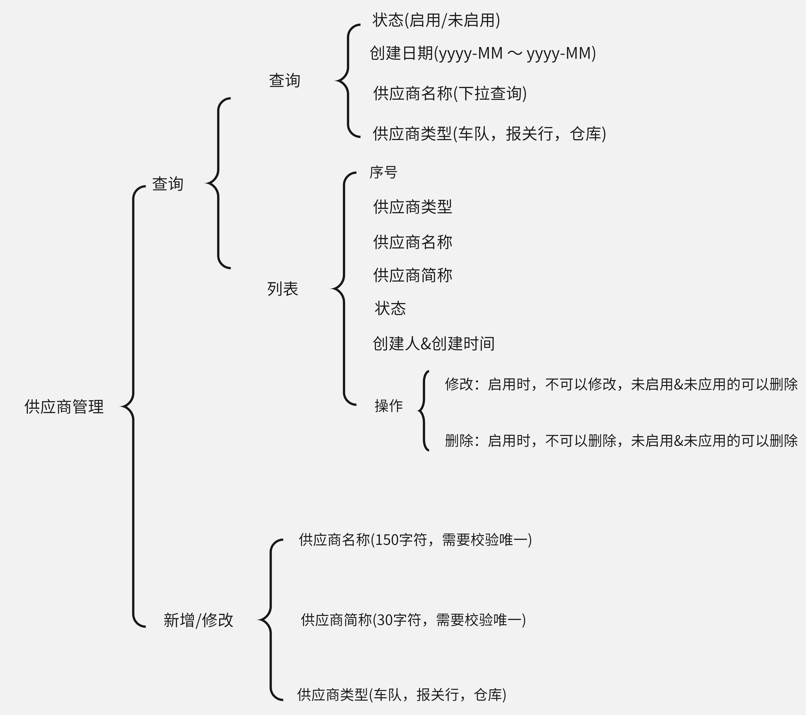

### 海运KPI

### 需求背景
目前公司存在许多合作的供应商，为了挑选优质供应商，所以需要对供应商进行一个考核打分。考核人员为海运部门对接人员。每月5日00:00:00～7日59:59:59可进行打分。对接人员考核完成后，交由上级审核。上级可进行修改(参与考核人员的平均分)、审核。审核完成后根据平均分进行分等级。劣者淘汰。

实行淘汰制，主要分为4个等级 
- A：90≤分数≤100
- B：80≤分数<90
- C：70≤分数<80
- D：分数<70

### 模块
- 供应商管理 

**模块介绍：**
对合作的供应商进行一个统一管理。

- 模版管理
- 考核管理
- 审核管理
