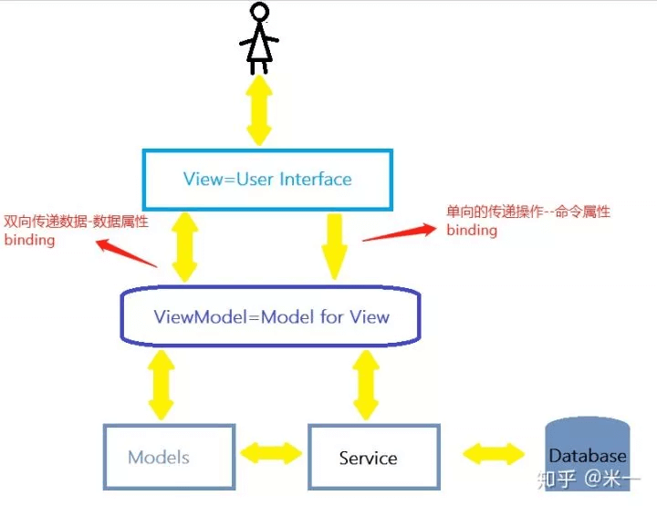

### Vue的理解

#### Vue的核心特性
`MVVM`表示的是`Model-View-ViewModel`
- Model：模型层，负责处理业务逻辑以及和服务器端进行交互
- View：视图层，负责将数据模型转化为U I展示出来，可以简单的理解为HTML页面
- ViewModel：视图模型层，用来连接Model和View，是Model和View之间的通信桥梁  

流程图如下  


#### 理解ViewModel
他的主要职责就是
- 数据变化后更新试图
- 视图变化后更新数据
当然，他还有两个主要部分组成
- 监听器(Observer): 对所有数据的属性进行监听
- 解析器(Compiler): 对每个元素节点的指令进行扫描跟解析，根据指令模版替换数据，以及绑定相应的更新函数

#### 实现双向绑定
以`Vue`为例，先来看看`Vue`中的双向绑定流程是什么样的
1. `new Vue()`首先执行初始化，对`data`执行响应式处理，这个过程发生在`Observer`中
2. 同时对模版执行编译，找到其中动态绑定的数据，从`data`中获取并初始化视图，这个过程发生在`Compiler`中
3. 同时定义一个更新函数和`watcher`，将来对应数据变化时`Watcher`会调用更新函数
4. 由于`data`的某个`key`在一个视图中可能出现多次，所以每个`key`都需要一个`Dep`来管理多个`Watcher`
5. 将来data中的数据一旦发生变化，会首先找到对应的`Dep`，通知所有`Watcher`执行更新函数

流程图如下  


#### 实现
先创建一个构造函数：执行初始化，对`data`执行响应式处理
``` js
class Vue {
  constructor(options) {
    this.$options = options;
    this.$data = options.data;
  }
  // 对data选项做响应式处理
  observe(this.$data)
  // 代理data到vm上
  proxy(this)
  // 执行编译
  new Compile(options.el, this)
}
```
对`data`选型执行响应化具体操作
``` js
function observe(obj) {
  if(typeof obj !== "object" || obj === null) {
    retrun;
  }
  new Observe(obj);
}

class Observe {
  constructor(value) {
    this.value = value;
    this.walk(value);
  }
  walk(obj) {
    Object.keys(obj).forEach((key) => [
      defineReactive(obj, key, obj[key]);
    ])
  }
}
```